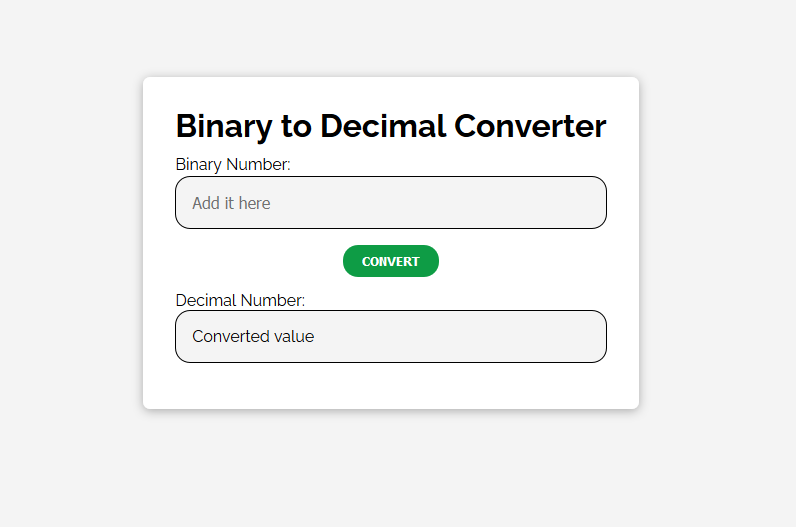

This is a simple script that coverts a binary number into a decimal number.

Please read [my blogpost about it](https://nslpad.netlify.app/binary-to-decimal-converter/).

## License
This project uses [the MIT License](https://github.com/nslcoder/binarytodecimalconverter/blob/master/LICENSE.md).